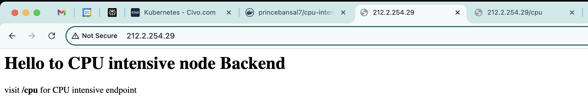
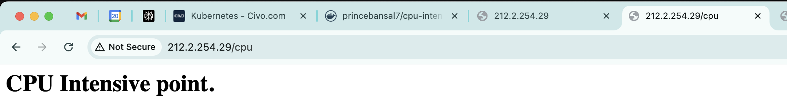
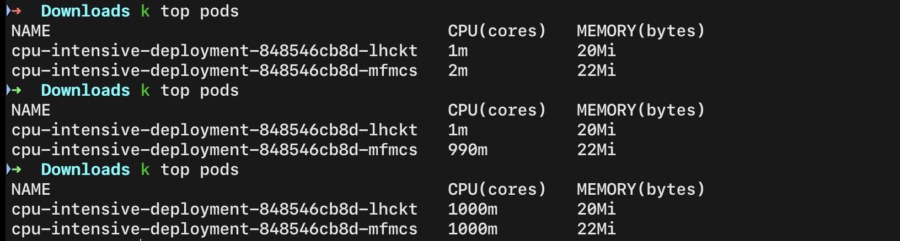
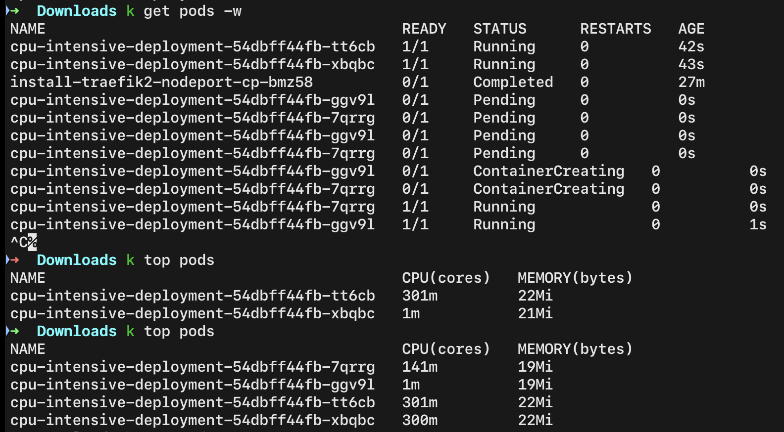
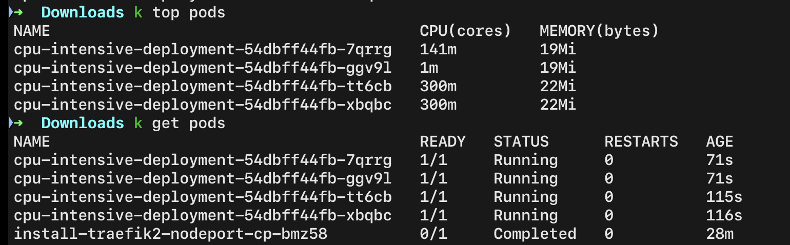
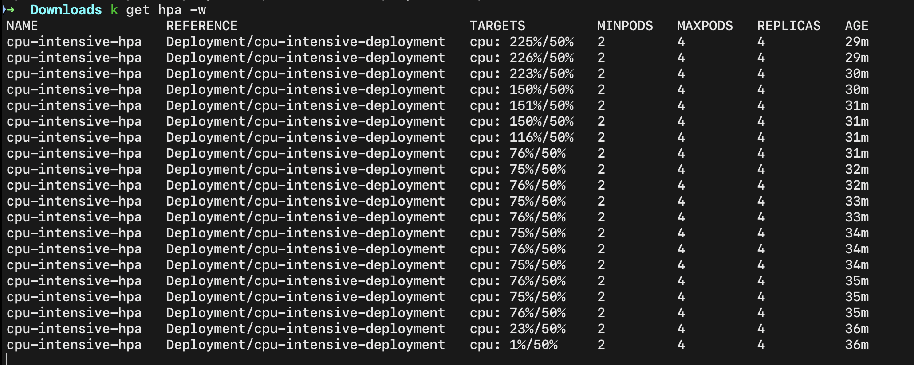
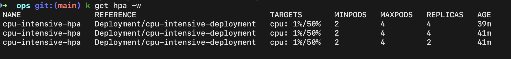
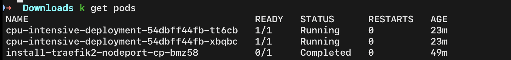

## HPA (Horizontal Pod Autoscaler) & Metrics server

- To install metrics server
  ```sh
  kubectl apply -f https://github.com/kubernetes-sigs/metrics-server/releases/latest/download/components.yaml
  ```
- HPA & metrics related commands
  ```sh
  k get hpa -w
  k describe hpa <hpa-name>
  k top pods
  ```
- Visiting `/` endpoint
  
    

- Visiting `/cpu` endpoint => triggers CPU intensive task
  
    

- HPA triggers pod autoscaling as CPU usage increases
  
    
  
    

    

- CPU usage getting down
  
    
  

- CPU usage down => HPA downscaling the pods
  
    
  
    